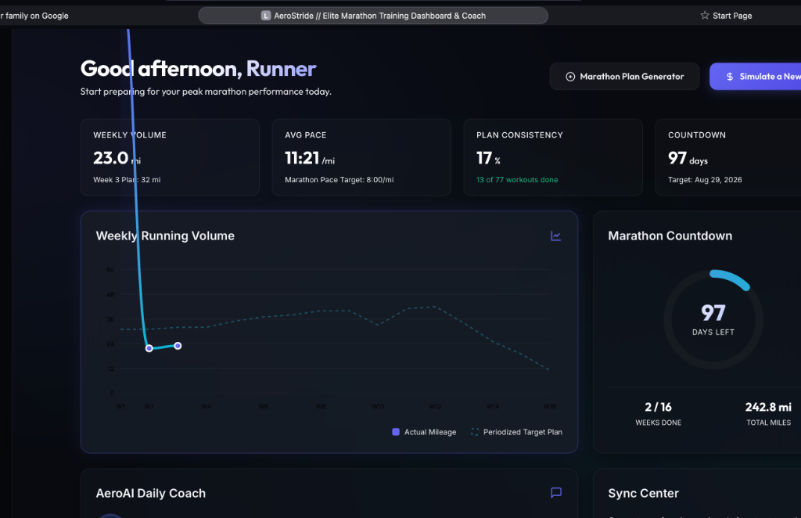

# 🏃 AeroStride // Elite AI Marathon Training Dashboard & Coach

AeroStride is an ultra-premium, high-fidelity interactive training dashboard designed to prepare athletes for peak marathon performance. Built using **glassmorphic design principles and responsive layouts**, AeroStride bridges the gap between raw biometrics and elite athletic coaching by synchronizing directly with **Garmin Connect** and **Strava**.

By utilizing advanced cardiac metrics and periodization algorithms, AeroStride offers a hyper-personalized coaching portal that adapts to your training load, cardiac decoupling, and real-time biomechanics.

---

## 📸 Interface Preview

Below is a preview of the main interactive dashboard displaying a premium dark-themed glassmorphic cockpit, periodized volume chart, and multi-sport training metrics:



---

## ⚡ Key Features

### 1. Dedicated AeroAI Coach Page
A dedicated, full-width performance portal built for deep athletic evaluation:
*   **Daily Bio-Indicators**: Log sleep quality, check for joint soreness, and review today's scheduled recovery orBase training targets.
*   **30-Day Athlete Intelligence Trends**:
    *   **Aero-Exertion Strain Index**: A rolling chronic training load calculated from active workout durations and cardiac zones.
    *   **30-Day HR Intensity Zones**: A triple-segmented visual bar mapping minutes spent in Zone 1 (Recovery), Zone 2 (Aerobic Base), and Zone 3 (Tempo/Threshold).
    *   **Dynamic Coach Insights**: Auto-generated sports-science advice analyzing cardiorespiratory drift, stroke volume efficiency, and pace progressions.

### 2. Symmetrical Dashboard Cockpit
*   **Weekly Running Volume Chart**: Interactive SVG area chart mapping actual mileage against your periodized target curve, with custom hover tooltips.
*   **Marathon Countdown Ring**: A circular neon-glow progress indicator counting down days and tracking total mileage and completed weeks.
*   **Integration Hub & Sync Center**: One-click connection to Garmin Connect and Strava, featuring production sync beacons and automated MFA (Multi-Factor Authentication) OTP secure prompts.
*   **2026 YTD Training Summary**: High-fidelity sport progress bars tallying runs, rides, swims, strength sessions, and walks.

### 3. Comprehensive Multi-Sport Training Log
*   Chronologically feeds every logged workout from your history.
*   **AeroAI Performance Assessment**: Click any activity card to instantly expand **🟢 What Went Well** (e.g., cardiac decoupling, baseline pacing) and **🟡 What Can Improve** (e.g., cadence adjustments, hydration replenishment).
*   **Pace Filtering**: Running pace metrics are calculated independently of cycling rides, swimming splits, or recovery walks to ensure 100% calculation accuracy.

### 4. Interactive "Say More" Inline AI Coach
Clicking *“✦ Say More”* inside any run card unfolds a conversational training log chat:
*   **Context-Aware Prompt Chips**: Ask instant queries about cardiovascular drift, next steps, or specific calf/quad stretch recommendations.
*   **Typewriter Responder**: Generates responsive, elite physiological advice based on your exact split paces and cardiac thresholds.

### 5. AI Adaptive Plan Recalibrator
If you miss runs, experience fatigue, or complete baseline targets faster than scheduled, click **✦ Recalibrate Plan** in the calendar:
*   **Choose from 3 Periodization Strategies**:
    1.  **Bio-Adaptive Auto-Taper**: Safely scales down remaining volume by 15% and focuses on low-impact recovery to protect knee ligaments.
    2.  **Peak Volume Acceleration**: Safely escalates remaining block volumes by 10% to push cellular threshold boundaries.
    3.  **Conservative Periodization**: Re-allocates missed targets evenly across remaining weeks to spread physical stress.

---

## 🛠️ Technology Stack

*   **Frontend**: Vanilla HTML5, CSS3 (Glassmorphism, custom custom CSS properties, flex flows, neon glows), Client-Side JS (Dynamic SVG generators, interactive chat loops, modal states).
*   **Backend**: Flask 3.0 (Python), robust production session managers.
*   **Database**: SQLite (SQL query optimizations, date-range activity mapping, pre-training `week = 0` classification).

---

## 🚀 Installation & Local Setup

### Prerequisite: Set up your python environment
Make sure Python 3.9+ is installed on your Mac.

### 1. Clone & Navigate to Repository
```bash
cd /Users/balasubramanichandran/Documents/RunningAssistant
```

### 2. Install Required Python Packages
```bash
pip3 install flask requests
```

### 3. Run the Server
```bash
python3 server.py
```
*The server will start instantly and listen on **`http://localhost:8000`**.*

### 4. Access the App
Open your default web browser and navigate to:
👉 **[http://localhost:8000](http://localhost:8000)**

---

## 🛡️ Security & Privacy
AeroStride respects your privacy. All Strava keys, Garmin emails, and passwords entered in the Sync Center are stored securely inside your local **SQLite database (`database.db`)** which is fully ignored in Git to prevent any security leaks.
